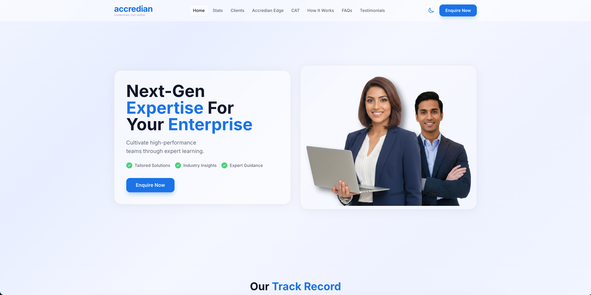
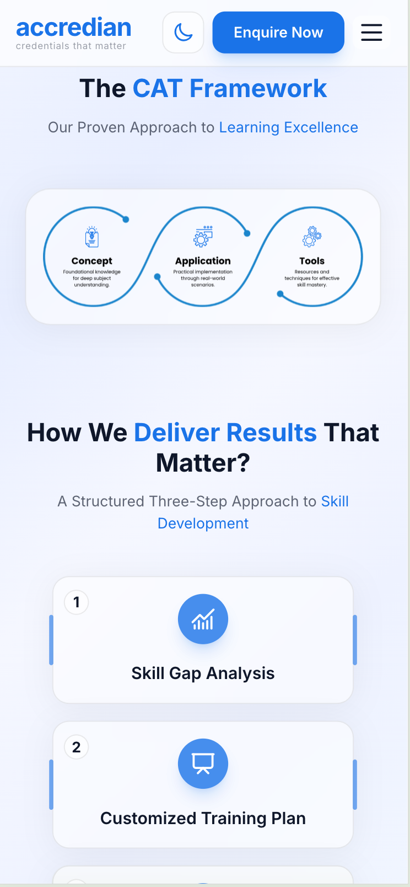
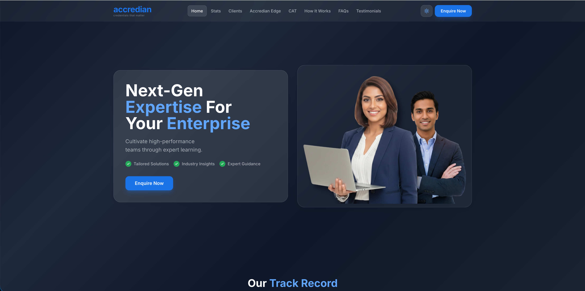
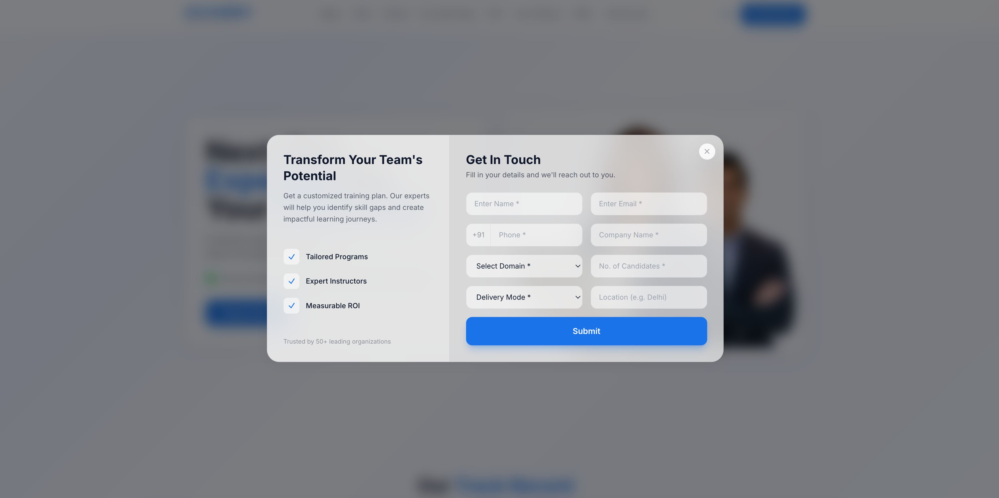

# Accredian Enterprise Page Clone

A pixel-accurate recreation of the [Accredian Enterprise](https://enterprise.accredian.com/) website built with **Next.js 14**, **TypeScript**, and **Tailwind CSS**. Features a fully responsive design, dark/light theme support, smooth scroll-triggered animations, modular component architecture, and a lead capture form with API integration.


---

## 🚀 Live Demo

🔗 **[View Live Site](https://your-deployment-url.vercel.app)**

---

## 📋 Table of Contents

- [Features](#-features)
- [Tech Stack](#-tech-stack)
- [Setup Instructions](#-setup-instructions)
- [Project Structure](#-project-structure)
- [Architecture Overview](#-architecture-overview)
- [Approach Taken](#-approach-taken)
- [AI Usage Explanation](#-ai-usage-explanation)
- [Bonus Features](#-bonus-features)
- [Improvements with More Time](#-improvements-with-more-time)

---

## ✨ Features

### Landing Page Sections
- **Navigation Bar** — Sticky navbar with smooth scroll navigation, active section highlighting, responsive mobile hamburger menu, and dark/light theme toggle
- **Hero Section** — Animated hero with gradient card, floating elements, and dual CTAs
- **Track Record (Stats)** — Animated counter numbers with intersection observer triggers
- **Proven Partnerships** — Partner company logo grid with hover effects
- **Accredian Edge** — Feature cards with highlighted benefits banner
- **Domain Expertise** — Colorful gradient icon cards for each domain
- **Course Segmentation** — 4-column cards with gradient headers and tag chips
- **Who Should Join** — Glassmorphism cards on gradient background
- **CAT Framework** — Connected step cards (Concept → Application → Tools)
- **How It Works** — 3-step process cards with numbered badges
- **FAQs** — Category sidebar with accordion items
- **Testimonials** — Auto-playing carousel with dot navigation
- **Footer** — CTA banner, social links, contact info, and copyright

### Functional Requirements ✅
- ✅ Fully responsive (mobile + tablet + desktop)
- ✅ Dark / Light theme with localStorage persistence
- ✅ Clean and structured UI with consistent design system
- ✅ Reusable components with TypeScript props-based configuration
- ✅ Smooth scroll navigation between sections
- ✅ Intersection Observer animations (fade-in, slide-left, slide-right)
- ✅ Active section highlighting in navbar
- ✅ All hardcoded data externalized into typed data files

---

## 🛠 Tech Stack

| Technology | Purpose |
|-----------|---------|
| **Next.js 14** (App Router) | React framework with SSR & API routes |
| **TypeScript** | Type safety and better DX |
| **Tailwind CSS 3.4** | Utility-first styling with custom theme |
| **CSS Custom Properties** | Dark/light theme variables |
| **React Context API** | Theme state management |
| **React Hooks** | State management & custom hooks |
| **Intersection Observer API** | Scroll-triggered animations |
| **Next.js API Routes** | Backend for lead capture (Bonus) |
| **Vercel** | Deployment platform |

---

## 📦 Setup Instructions

### Prerequisites
- **Node.js** >= 18.x
- **npm** >= 9.x (or yarn/pnpm)

### Installation

```bash
# 1. Clone the repository
git clone https://github.com/Anshjn1411/Accredian-Assignment.git
cd Accredian-Assignment

# 2. Install dependencies
npm install

# 3. Run the development server
npm run dev

# 4. Open in browser
# Visit http://localhost:3000
```

### Build for Production

```bash
npm run build
npm start
```

### Deploy to Vercel

```bash
url:- https://accredian-assignment-lilac.vercel.app/
```

---

## 📁 Project Structure

```
assingment-intern/
├── src/
│   ├── app/                          # Next.js App Router
│   │   ├── api/
│   │   │   └── leads/
│   │   │       └── route.ts          # REST API for lead capture (POST/GET)
│   │   ├── globals.css               # Theme variables, glass-card system, animations
│   │   ├── layout.tsx                # Root layout with metadata, fonts & ThemeProvider
│   │   └── page.tsx                  # Main page — assembles all sections
│   │
│   ├── components/
│   │   ├── layout/                   # Structural layout components
│   │   │   ├── Navbar.tsx            # Sticky nav with mobile menu & theme toggle
│   │   │   └── Footer.tsx            # Footer with CTA banner & social links
│   │   ├── sections/                 # Page section components (one per section)
│   │   │   ├── Hero.tsx              # Hero section with animated elements
│   │   │   ├── Stats.tsx             # Animated counter stats
│   │   │   ├── Clients.tsx           # Partner logos grid
│   │   │   ├── AccredianEdge.tsx     # Features & highlights section
│   │   │   ├── DomainExpertise.tsx   # Domain cards grid
│   │   │   ├── CourseSegmentation.tsx # Course category cards
│   │   │   ├── WhoShouldJoin.tsx     # Target audience section
│   │   │   ├── CATFramework.tsx      # C-A-T process flow
│   │   │   ├── HowItWorks.tsx        # 3-step process section
│   │   │   ├── FAQs.tsx             # FAQ accordion with category tabs
│   │   │   └── Testimonials.tsx      # Testimonial carousel
│   │   ├── ui/                       # Reusable UI components
│   │   │   └── EnquiryForm.tsx       # Lead capture modal form (Bonus)
│   │   └── providers/                # React Context providers
│   │       └── ThemeProvider.tsx      # Dark/light theme context & toggle
│   │
│   ├── data/                         # Externalized data files (typed, no hardcoding)
│   │   ├── navigation.ts            # Navbar menu items
│   │   ├── stats.ts                 # Track record statistics
│   │   ├── clients.ts              # Partner company logos
│   │   ├── domains.ts              # Domain expertise cards
│   │   ├── courses.ts             # Course segmentation data
│   │   ├── audiences.ts           # "Who Should Join" audience cards
│   │   ├── faqs.ts                # FAQ categories & Q&A pairs
│   │   ├── testimonials.ts        # Client testimonials
│   │   └── social.ts             # Social media links & SVG paths
│   │
│   ├── hooks/                        # Custom React hooks
│   │   └── useScrollAnimation.ts     # Intersection Observer hook for animations
│   │
│   ├── lib/                          # Shared utilities & constants
│   │   └── constants.ts              # Site config, asset URLs, form defaults
│   │
│   └── types/                        # TypeScript type definitions
│       └── index.ts                  # All shared interfaces & types
│
├── tailwind.config.ts                # Custom theme: colors, fonts, animations, keyframes
├── next.config.mjs                   # Next.js config (image remotePatterns)
├── postcss.config.mjs                # PostCSS with Tailwind & Autoprefixer
├── tsconfig.json                     # TypeScript config with path aliases (@/)
└── package.json                      # Dependencies & scripts
```

---


## 📸 Screenshots

### Desktop View


### Mobile View


### Dark Theme


### Light Theme



## 🏗 Architecture Overview

```
┌─────────────────────────────────────────────────────────────────┐
│                        layout.tsx                                │
│                  (Metadata + Fonts + ThemeProvider)               │
│  ┌───────────────────────────────────────────────────────────┐  │
│  │                       page.tsx                             │  │
│  │              ┌─────────────────────┐                      │  │
│  │              │   EnquiryForm State  │ (useState hook)      │  │
│  │              └──────────┬──────────┘                      │  │
│  │                         │ onEnquireClick                   │  │
│  │  ┌──────────┬───────────┼───────────┬──────────────┐      │  │
│  │  ▼          ▼           ▼           ▼              ▼      │  │
│  │ Navbar    Hero       FAQs        Footer      EnquiryForm  │  │
│  │  │         │           │           │             │        │  │
│  │  ▼         ▼           ▼           ▼             ▼        │  │
│  │ Stats → Clients → AccredianEdge → DomainExpertise →  ...  │  │
│  └───────────────────────────────────────────────────────────┘  │
└─────────────────────────────────────────────────────────────────┘

Data Flow:
  types/index.ts  ──→  data/*.ts  ──→  components/sections/*.tsx
  lib/constants.ts ──→  components/layout/*.tsx
  hooks/useScrollAnimation.ts  ──→  components/sections/*.tsx

Theme Flow:
  ThemeProvider (Context) ──→  data-theme attribute ──→  CSS Variables (globals.css)
```

### Key Architectural Patterns

| Pattern | Implementation |
|---------|---------------|
| **Separation of Concerns** | Data, types, components, hooks, and utilities each have dedicated directories |
| **Type Safety** | All data files use interfaces from `types/index.ts`; no `any` types |
| **Data Externalization** | Zero hardcoded content in components — all pulled from `data/*.ts` |
| **Props-Driven Components** | Enquiry modal state lifted to `page.tsx`, passed via props (no global store) |
| **Theme System** | CSS custom properties toggled via `data-theme` attribute, managed by React Context |
| **Custom Hook** | `useScrollAnimation` encapsulates IntersectionObserver logic for reuse |
| **Glass Design System** | `.glass-card`, `.t-heading`, `.t-body`, `.btn-primary` via `@layer components` |
| **Responsive Approach** | Mobile-first Tailwind breakpoints + `clamp()` for fluid typography |

---

## 🧠 Approach Taken

### 1. Research & Planning
- Thoroughly studied the reference site (enterprise.accredian.com) — captured screenshots and documented every section's content, layout, colors, and interactions.
- Identified the design system: primary blue (#1A73E8), clean white/gray backgrounds, rounded cards, and smooth transitions.
- Planned component hierarchy and data flow (particularly the shared enquiry modal state).

### 2. Architecture Decisions
- **Next.js App Router** for modern React patterns and built-in API routes.
- **Component-per-section** approach for maximum reusability and maintainability.
- **Modular data layer** — all hardcoded content extracted into typed `data/*.ts` files, keeping components purely presentational.
- **Props-driven configuration** — components like Navbar and Footer receive `onEnquireClick` as props rather than using global state, keeping the architecture simple.
- **Custom hooks** — `useScrollAnimation` abstracts IntersectionObserver logic for consistent scroll-triggered animations across sections.
- **Theme provider pattern** — React Context + CSS custom properties for dark/light mode with localStorage persistence.

### 3. Styling Strategy
- **Tailwind CSS** with a custom theme extending colors, fonts, and animations.
- **CSS custom properties** for design tokens, enabling easy theming across dark/light modes.
- **Custom `@layer components`** for reusable utility classes (`.btn-primary`, `.section-heading`, `.glass-card`, `.t-heading`, `.t-body`, `.img-adapt`).
- **Glassmorphism design system** — consistent backdrop-blur, semi-transparent backgrounds, and border effects.

### 4. Responsive Design
- Mobile-first approach with Tailwind breakpoints (sm, md, lg).
- Hamburger menu for mobile navigation.
- Grid layouts that collapse gracefully on smaller screens.
- `clamp()` for fluid typography scaling.
- Touch-friendly interactive elements.

### 5. Performance Optimization
- Intersection Observer for lazy animations (only animate when visible).
- SVG icons instead of icon libraries (no extra bundle size).
- Minimal dependencies (only `lucide-react` beyond Next.js core).
- Theme transition with CSS `transition` for smooth visual switches.

---

## 🤖 AI Usage Explanation

### Where AI Helped

| Area | AI Tool Used | How It Helped |
|------|-------------|---------------|
| **Project scaffolding** | Antigravity (Claude) | Generated the initial project structure, config files, and component boilerplate |
| **Component code** | Antigravity (Claude) | Created all 11 section components with proper TypeScript types, responsive layouts, and animations |
| **Content extraction** | Antigravity (Browser Agent) | Captured and documented the reference website's content, layout, and visual design |
| **API route** | Antigravity (Claude) | Built the leads API with validation and file-based persistence |
| **Tailwind config** | Antigravity (Claude) | Designed the custom theme with colors, animations, and keyframes |
| **Architecture refactor** | Antigravity (Claude) | Restructured from flat components into modular architecture (data/, hooks/, types/, providers/) |
| **README** | Antigravity (Claude) | Generated this comprehensive documentation |

### What I Modified/Improved Manually
- **Design refinements**: Adjusted spacing, colors, and visual hierarchy to match the reference more closely
- **Animation tuning**: Fine-tuned transition delays and animation curves for smoother UX
- **Mobile responsiveness**: Tested and fixed layout issues on various screen sizes
- **Form validation**: Added proper client-side and server-side validation logic
- **Content accuracy**: Verified all text content matches the original site
- **Code cleanup**: Refactored repetitive patterns and ensured consistent coding style

---

## ⭐ Bonus Features

### 1. Dark / Light Theme
- Full theme toggle with smooth CSS transitions
- Theme preference persisted in localStorage
- CSS custom properties for zero-flicker theme switching
- Automatic image filter adaptation (`invert()`) for logo visibility

### 2. Lead Capture Form
- Full modal form with 8 fields matching the original site
- Client-side form validation
- Animated submit button with loading state
- Success confirmation screen
- Beautiful two-panel layout with visual side panel

### 3. API Integration (Next.js API Routes)
- **POST `/api/leads`** — Submits and stores lead data with validation
- **GET `/api/leads`** — Retrieves all submitted leads (admin endpoint)
- File-based JSON persistence (works on Vercel)
- Email format validation
- Required field checks

---

## 🔮 Improvements with More Time

1. **Database Integration** — Replace file-based storage with a proper database (PostgreSQL via Prisma, or MongoDB)
2. **Admin Dashboard** — Build an admin page to view/manage submitted leads with filtering and export
3. **Email Notifications** — Send automated confirmation emails to leads using services like Resend or SendGrid
4. **Image Optimization** — Use actual company logos (with permission) and optimize with Next.js Image component
5. **Advanced Animations** — Add Framer Motion for more sophisticated page transitions and micro-interactions
6. **SEO Enhancement** — Add structured data (JSON-LD), sitemap.xml, and robots.txt
7. **Testing** — Add unit tests with Jest/React Testing Library and E2E tests with Playwright
8. **Accessibility** — Full ARIA compliance, keyboard navigation, and screen reader optimization
9. **Performance** — Implement route-based code splitting and optimize Core Web Vitals scores
10. **Internationalization** — Add multi-language support with next-intl
11. **Analytics** — Integrate Google Analytics or Plausible for user behavior tracking

---

## 📄 License

This project is built for educational/assessment purposes as part of the Accredian Full Stack Developer Intern application.

---

Built with ❤️ by [Ansh Jain]
